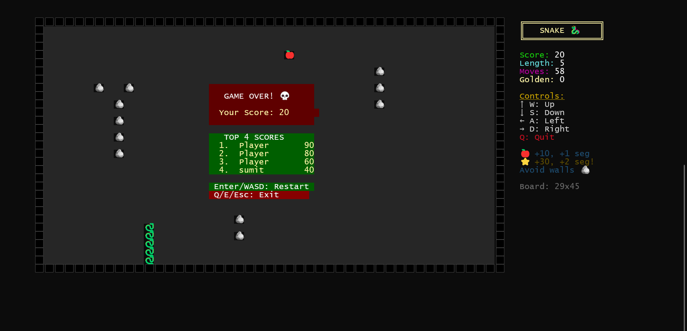
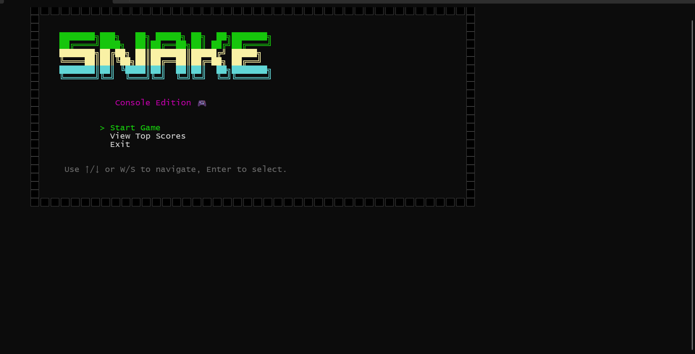

# Snake (Console Edition)

A fast, colorful, cross-platform console Snake game built with modern C++ and CMake.

### Screenshots

**Game Screen**  


**Main Screen**  


### For Players (Build & Play)
...


### For Players (Build & Play)

- **Prerequisites**
  - CMake 3.12+
  - C++17 compiler
    - Windows: MSVC (Visual Studio) or MinGW-w64
    - Linux: GCC 7+ or Clang 5+
    - macOS: Xcode Command Line Tools (Clang)

- **Quick Start (Windows PowerShell)**
  ```powershell
  cmake -S . -B build -DCMAKE_BUILD_TYPE=Release
  cmake --build build
  .\build\snake.exe
  ```

- **Quick Start (Linux/macOS)**
  ```bash
  cmake -S . -B build -DCMAKE_BUILD_TYPE=Release
  cmake --build build --parallel
  ./build/snake
  ```

- **Controls**
  - Menu: ↑/↓ or W/S to navigate, Enter to select
  - In-game movement: Arrow keys or WASD
  - Quit game: Q
  - After Game Over: Enter/WASD to restart, Q/E/Esc to exit

- **Troubleshooting**
  - If the terminal looks garbled after exit on Linux/macOS, simply press Enter once or clear the screen (`reset` or `clear`).
  - On Windows, run from a UTF-8 capable console (Windows Terminal or PowerShell). The game sets UTF-8 automatically.

### For Developers (Contribute & Build)

- **Project Structure**
  - `src/`: game logic, UI, rendering, platform I/O
  - `include/`: public headers
  - `CMakeLists.txt`: build configuration (targets, warnings, install rules)
  - `BUILD.md`: detailed multi-OS build guide

- **Build Variants**
  - Release (default): optimized, defines `NDEBUG`
  - Debug: symbols, no optimizations, defines `DEBUG`
  
  Examples:
  ```bash
  # Release
  cmake -S . -B build -DCMAKE_BUILD_TYPE=Release && cmake --build build

  # Debug
  cmake -S . -B build -DCMAKE_BUILD_TYPE=Debug && cmake --build build --parallel
  ```

- **Windows (MSVC / MinGW)**
  ```powershell
  # MSVC (default generator)
  cmake -S . -B build -DCMAKE_BUILD_TYPE=Debug
  cmake --build build

  # MinGW
  cmake -S . -B build -G "MinGW Makefiles" -DCMAKE_BUILD_TYPE=Release
  cmake --build build
  ```

- **Run**
  - Windows: `build\snake.exe`
  - Linux/macOS: `./build/snake`

- **Install (optional)**
  ```bash
  cmake --install build --component Runtime --prefix <dest>
  # Binaries will be placed in <dest>/bin
  ```

- **Code Quality**
  - C++17, high warning levels: `/W4` (MSVC) and `-Wall -Wextra -Wpedantic` (others)
  - Keep functions small and clear; avoid deep nesting
  - Prefer descriptive names and early returns

- **Clean Build**
  ```bash
  # Windows PowerShell
  Remove-Item -Recurse -Force build

  # Linux/macOS
  rm -rf build
  ```

For more detailed, platform-specific steps, see `BUILD.md`.


